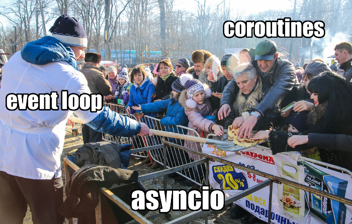
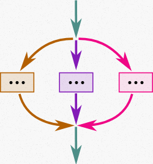

---

# Generator

---

# Generator

    !python
    def fib(n):
        a, b = 0, 1
        for _ in range(n):
            yield a
            a, b = b, a + b

    for x in fib(10):
        print(x)

# Presenter Notes
объяснить флоу

у генератора есть `__iter__` (который возвращает сам себя как на прошлом слайде) и `__next__` (как у итератора)

это пример генератора, который используется как итератор, но у генератора есть дополнительные
свойства, которых нет у итератора

---

# Generator

    !python
    def gen():  # <-
        s = 0
        while True:
            x = yield s
            s += x

    g = gen()  # <generator object gen at 0x7fb8cfbfb7d8>

# Presenter Notes
объект-генератор создан, но код ещё не выполнялся

помимо `__iter__` и `__next__` есть `send`, `throw`, `close`

---

# Generator

    !python
    def gen():
        s = 0
        while True:
            x = yield s  # <-
            s += x

    g = gen()
    assert g.send(None) == 0

# Presenter Notes
первый send не попадёт в x, а только дойдёт до yield

---

# Generator

    !python
    def gen():
        s = 0
        while True:
            x = yield s  # <-
            s += x

    g = gen()
    assert g.send(None) == 0
    assert g.send(1) == 1
    assert g.send(2) == 3
    assert g.send(3) == 6

# Presenter Notes
флоу

---

# Generator

    !python
    def gen():
        s = 0
        while True:
            x = yield s  # <-
            s += x

    g = gen()
    assert g.send(None) == 0
    assert g.send(1) == 1
    assert g.send(2) == 3
    assert g.send(3) == 6
    g.close()

# Presenter Notes
генератор можно остановить (бросить исключение GeneratorExit внутрь)

---

# Generator

    !python
    def gen():
        s = 0
        while True:
            x = yield s  # <-
            s += x

    g = gen()
    assert g.send(None) == 0
    assert g.send(1) == 1
    assert g.send(2) == 3
    assert g.send(3) == 6
    g.throw(Exception("FOO"))

# Presenter Notes
можно бросить кастомной исключение

---

# Generator

    !python
    def gen():
        s = 0
        while True:
            try:
                x = yield s
            except Exception:
                yield "error"
                break
            s += x

    g = gen()
    assert g.send(None) == 0
    assert g.send(1) == 1
    assert g.send(2) == 3
    assert g.send(3) == 6
    assert g.throw(Exception("FOO")) == "error"

# Presenter Notes
генератор может обработать исключение

---

# Generator

PEP380 — Syntax for Delegating to a Subgenerator (Python 3.3)

# Presenter Notes
в далёком 2009 году Gregory Ewing предложил то, что позволило в последствии появиться целому семейству библиотек
использующих неблокирующие операции и сейчас это целое направление в разработке на пифоне

кто-нибудь слышал о tornado?

угадайте в каком году был первый релиз... 2009

так что же он предложил?

---

# Generator

PEP380 — Syntax for Delegating to a Subgenerator (Python 3.3)

    !python
    def gen1():
        yield 1
        yield 2
        return 3

    def gen2():
        value = yield from gen1()
        assert value == 3

    for x in gen2():
        print(x)
    # 1
    # 2

# Presenter Notes
что даёт?

стек генераторов, механизм абстракции схожий с функциями

что сделает send?

---

# Generator

PEP380 — Syntax for Delegating to a Subgenerator (Python 3.3)

    !python
    def gen1():
        yield 1
        yield 2
        return 3

    def gen2():
        value = yield from gen1()
        assert value == 3

    g = gen2()
    assert g.send(None) == 1
    assert g.send(None) == 2

# Presenter Notes
всё как ожидается, значения доходят до того, кто сделал yield (gen1)

gen2 вообще ничего не yield-ит

как работает return?

---

# Generator

PEP380 — Syntax for Delegating to a Subgenerator (Python 3.3)

    !python
    def gen1():
        yield 1
        yield 2
        raise StopIteration(3)

    def gen2():
        value = yield from gen1()
        assert value == 3

    g = gen2()
    assert g.send(None) == 1
    assert g.send(None) == 2

# Presenter Notes
а значит можно написать класс, который будет себя вести как генератор и который
можно использовать в yield from

генераторы — очередной очень полезный сахар, который при этом вписывается в объектную модель питона
и может быть заменён на слегка необычный класс

---

# Generator

PEP380 — Syntax for Delegating to a Subgenerator (Python 3.3)

    !python
    class gen1:
        def __init__(self):
            self.v = 1

        def __iter__(self):
            return self

        def __next__(self):
            if self.v > 2:
                raise StopIteration(3)
            v = self.v
            self.v += 1
            return v

    def gen2():
        value = yield from gen1()
        assert value == 3

    g = gen2()
    assert g.send(None) == 1
    assert g.send(None) == 2

# Presenter Notes
4 строчки против 13 не очень-то читаемых magic методов

но(!) важно знать, что это всё не какая-то магия, а просто сахар

итоги: у нас есть генераторы и делегирование (pep380)

что дальше?

---

# Generator-based framework

# Presenter Notes
что это? и почему это нас должно интересовать?

все существующие фреймворки: asyncio, trio, curio, tornado (со своим лупом) работают по принципу,
который мы сейчас рассмотрим

---

# Generator-based framework

    !python
    def a():
        trace("a enter")
        time.sleep(1)
        trace("a exit")

    def b():
        trace("b enter")
        time.sleep(.5)
        trace("b middle")
        time.sleep(.5)
        trace("b exit")

    a()
    b()

    # 0.000 a enter
    # 1.001 a exit
    # 1.001 b enter
    # 1.502 b middle
    # 2.002 b exit

# Presenter Notes
a и b не могут выполняться одновременно из-за блокирующего вызова

хотя казалось бы, почему бы двум функциям не спать одновременно?
не ждать данных из сокета одновременно? и т.д.

нам нужен фреймворк, который позволит им использовать sleep конкурентно

что значит конкурентно? это значит что все будут ждать сразу, но в самих функциях не должно быть
вызовов, мы должны их переложить на того, кто сможет объединить хотелки функций и отдавать им результат по готовности.
для этого подходят генераторы!

---

# Generator-based framework

    !python
    def a():
        trace("a enter")
        yield 1
        trace("a exit")

    def b():
        trace("b enter")
        yield .5
        trace("b middle")
        yield .5
        trace("b exit")

# Presenter Notes
вот так мы хотим

нужен кто-то, кто будет будет в нужное время инициировать очередную итерацию генератора

напишем простой loop

---

# Generator-based framework

    !python
    def a():
        trace("a enter")
        yield 1
        trace("a exit")

    def b():
        trace("b enter")
        yield .5
        trace("b middle")
        yield .5
        trace("b exit")

    def run(*gens):
        wakes = {g: 0 for g in gens}
        while wakes:
            g = min(wakes, key=lambda g: wakes[g])
            time.sleep(max(0, wakes[g] - time.time()))
            try:
                wakes[g] = time.time() + next(g)
            except StopIteration:
                wakes.pop(g)
    run(a(), b())

# Presenter Notes
принцип работы

аналогия с asyncio, только у нас просто next, а на самом деле надо ещё отправлять ответ:
байты из сокета, эксепшены и т.д.

---

# Generator-based framework

    !python
    def a():
        trace("a enter")
        yield 1
        trace("a exit")

    def b():
        trace("b enter")
        yield .5
        trace("b middle")
        yield .5
        trace("b exit")

    run(a(), b())

    # 0.000 a enter
    # 0.000 b enter
    # 0.500 b middle
    # 1.001 a exit
    # 1.001 b exit

# Presenter Notes
асинхронный фреймворк готов!

в реальных фреймворках yield спрятаны за вспомогательные генераторы и пользователь использует yield from

---

# Generator-based framework

    !python
    def sleep(t):
        trace("sleep enter")
        v = yield t
        trace("sleep exit")
        return v

    def foo():
        trace("foo enter")
        result = yield from sleep(1)
        assert result is None
        trace("foo exit")

    run(foo())

    # 0.000 foo enter
    # 0.000 sleep enter
    # 1.001 sleep exit
    # 1.001 foo exit

# Presenter Notes
это практически asyncio!

---

# Async sugar

---

# Async sugar

* async/await
#
    !python
    async def foo():
        await bar()

# Presenter Notes
в один прекрасный момент (python 3.5) было решено добавить ключевые слова async/await,
при этом суть не изменилась, просто более приятные и понятные названия

жёсткая пометка что это корутина, а не по наличию yield или декоратору

---

# Async sugar

* async/await
* async iterator
#
    !python
    class AIterator:
        def __aiter__(self):
            return self

        async def __anext__(self):
            # some async code

    async for v in AIterator():
        ...

# Presenter Notes
такие же методы только с приставкой "a"

обратите внимание, что aiter это обычная функция

---

# Async sugar

* async/await
* async iterator
* async context manager
#
    !python
    class AContext:
        async def __aenter__(self):
            # some async code

        async def __aexit__(self, *exc_info):
            # some async code

    async with AContext() as resource:
        ...

# Presenter Notes
такие же методы только с приставкой "a"

---

# Async sugar

* async/await
* async iterator
* async context manager
* async generator (asend, athrow, aclose)
#
    !python
    async def foo():
        for i in range(10):
            v = await bar()
            yield v

    async for v in foo():
        ...

# Presenter Notes
такие же методы только с приставкой "a"

нельзя yield в finally

cleanup не может выполняться вне лупа

---

# Async sugar

* async/await
* async iterator
* async context manager
* async generator (asend, athrow, aclose)
* async contextmanager from generator
#
    !python
    @contextlib.asynccontextmanager
    async def foo():
        resource = await initialize()
        try:
            yield resource
        finally:
            await finalize(resource)

    async with foo() as resource:
        ...

# Presenter Notes
в 3.7 добавили асинхронный контекстный менеджер

если добавить `yield from`, то можно будет делать фреймворки на асинхронных генераторах, иными словами
запускать loop внутри loop-а!

---

# Asyncio

---

# Asyncio
#
    !python
    async def a():
        trace("a enter")
        await asyncio.sleep(1)
        trace("a exit")

    async def b():
        trace("b enter")
        await asyncio.sleep(.5)
        trace("b middle")
        await asyncio.sleep(.5)
        trace("b exit")

    async def main():
        return await asyncio.gather(a(), b())

    asyncio.run(main())

    # 0.000 a enter
    # 0.000 b enter
    # 0.500 b middle
    # 1.001 a exit
    # 1.001 b exit

# Presenter Notes
такой же код как и с самописным фреймворком на генераторах

точки переключения контекста

однотредовость/псевдо-параллельность

---

# Asyncio
#
    !python
    async def a():
        trace("a enter")
        await asyncio.sleep(1)
        trace("a exit")

* `a` — coroutine function

# Presenter Notes
функция, возвращающая корутину

---

# Asyncio
#
    !python
    async def a():
        trace("a enter")
        await asyncio.sleep(1)
        trace("a exit")

* `a` — coroutine function
* `a()` — coroutine

# Presenter Notes
`await`, `send`, `close`, `throw`

корутина сама по себе не запустится

---

# Asyncio
#
    !python
    async def a():
        trace("a enter")
        await asyncio.sleep(1)
        trace("a exit")

* `a` — coroutine function
* `a()` — coroutine
* `asyncio.create_task(a())` — asyncio task

# Presenter Notes
таск ставится в очередь лупа

есть `cancel`, бросается `asyncio.CancelledError`

---

# Asyncio
#
    !python
    import asyncio
    import aiohttp

    async def fetch(url):
        async with aiohttp.ClientSession() as session:
            async with session.get(url) as response:
                return await response.json()

    async def main():
        urls = [...]
        coros = [fetch(url) for url in urls]
        return await asyncio.gather(*coros)

    results = asyncio.run(main())

---

# Asyncio and non-asyncio-aware code
#
    !python
    async def a():
        trace("a enter")
        time.sleep(1)
        trace("a exit")

    async def b():
        trace("b enter")
        await asyncio.sleep(.5)
        trace("b middle")
        await asyncio.sleep(.5)
        trace("b exit")

    async def main():
        return await asyncio.gather(a(), b())

    asyncio.run(main())

    # 0.000 a enter
    # 1.001 a exit
    # 1.001 b enter
    # 1.502 b middle
    # 2.003 b exit

# Presenter Notes
`time.sleep` блокирует тред/луп

`PYTHONASYNCIODEBUG`

---

# Asyncio and non-asyncio-aware code
#
    !python
    async def a():
        trace("a enter")
        loop = asyncio.get_running_loop()
        await loop.run_in_executor(None, time.sleep, 1)
        trace("a exit")

    async def b():
        ...

    async def main():
        return await asyncio.gather(a(), b())

    asyncio.run(main())

    # 0.000 a enter
    # 0.001 b enter
    # 0.502 b middle
    # 1.003 a exit
    # 1.003 b exit

# Presenter Notes
thread pool executor, process pool executor

проблемы канцеляции тредов

проблемы сериализации между процессами

обёртки/декораторы в jticker-core

---

# Asyncio and non-asyncio-aware code
# Что полезно исполнять в executor?

---

# Asyncio and non-asyncio-aware code
# Что полезно исполнять в executor:
* file io

---

# Asyncio and non-asyncio-aware code
# Что полезно исполнять в executor:
* file io
* network io

---

# Asyncio and non-asyncio-aware code
# Что полезно исполнять в executor:
* file io
* network io
* long™ running syscals

---

# Asyncio and non-asyncio-aware code
# Что полезно исполнять в executor:
* file io
* network io
* long™ running syscals
# Что бесполезно исполнять в thread executor?

---

# Asyncio and non-asyncio-aware code
# Что полезно исполнять в executor:
* file io
* network io
* long™ running syscals
# Что бесполезно исполнять в thread executor:
* cpu bound tasks (serialization, computation)

---

# Asyncio and non-asyncio-aware code
# Что полезно исполнять в executor:
* file io
* network io
* long™ running syscals
# Что бесполезно исполнять в thread executor:
* cpu bound tasks (serialization, computation)
* non-GIL-aware code

---

# Asyncio and non-asyncio-aware code
# Что полезно исполнять в executor:
* file io
* network io
* long™ running syscals
# Что бесполезно исполнять в thread executor:
* cpu bound tasks (serialization, computation)
* non-GIL-aware code
# Что бесползено исполнять в process executor?

---

# Asyncio and non-asyncio-aware code
# Что полезно исполнять в executor:
* file io
* network io
* long™ running syscals
# Что бесполезно исполнять в thread executor:
* cpu bound tasks (serialization, computation)
* non-GIL-aware code
# Что бесползено исполнять в process executor:
* serialization

---

# Asyncio and non-asyncio-aware code
# Что полезно исполнять в executor:
* file io
* network io
* long™ running syscals
# Что бесполезно исполнять в thread executor:
* cpu bound tasks (serialization, computation)
* non-GIL-aware code
# Что бесползено исполнять в process executor:
* serialization
* big™ data

# Presenter Notes
big data: большой объём данных на входе или выходе функции

---

# Asyncio and task spawn

---

# Asyncio and task spawn
#
    !python
    async def a():
        # some code before
        asyncio.create_task(asyncio.sleep(1))
        # some code after

https://vorpus.org/blog/notes-on-structured-concurrency-or-go-statement-considered-harmful/

# Presenter Notes
неструктуированная конкурентность

но другого механизма в asyncio пока нет!

отмена коммита со стримами и прочим

---

# Asyncio and task spawn
#
    !python
    async def a():
        # some code before
        asyncio.create_task(asyncio.sleep(1))
        # some code after

https://vorpus.org/blog/notes-on-structured-concurrency-or-go-statement-considered-harmful/

# Presenter Notes
неструктуированная конкурентность

но другого механизма в asyncio пока нет!

отмена коммита со стримами и прочим

---

# Asyncio and task spawn
# Solutions?

---

# Asyncio and task spawn
# Solutions:
* manual
#
    !python
    async def a():
        # some code before
        t = asyncio.create_task(asyncio.sleep(1))
        try:
            # some code after
        finally:
            t.cancel()
            await asyncio.wait(t)

# Presenter Notes
нужно остановить задачу и дождаться её остановки

минус: всегда где-нибудь забудешь что-нибудь

---

# Asyncio and task spawn
# Solutions:
* manual
* trio
#
    !python
    async with trio.open_nursery() as n:
        n.start_soon(self.a)
        n.start_soon(self.b)

# Presenter Notes
но не asyncio

asyncio хочет решить эту проблему

---

# Asyncio and task spawn
# Solutions:
* manual
* trio
* 3rd libs (aiojobs, mode)

# Presenter Notes
предпочтительный вариант

---

# Async is easy!

---

# Async is easy!

* context managers

---

# Async is easy!

* context managers
* use executors

---

# Async is easy!

* context managers
* use executors
* do not spawn without finalization

---

# Вопросы
